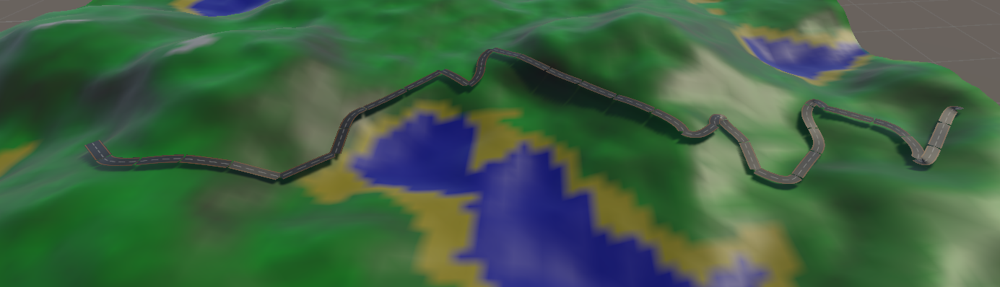

Team : Marwan Ait-Addi, Adjame Tellier-Rozen, Alex Clorennec, Anis Hammouche, Flavien Gonin

# Object and script need

In order to create road on the map, you will need a plane object, a TerrainGenerator, a GraphGenerator and the BezierRoadGenerator.

- Plane object : Create the default plane object of Unity.
- GraphGenerator : Give to this script the object where the TerrainGenerator is attached. The part debug graph is here in order to show the edges for a point. If you want to use give a number in Ind Point and click on the button "Generate edge in line renderer". If nothing appear, don't panick, you're just in the water.
- BezierRoadGenerator : Give to this script the object with the GraphGenerator, a width for the road, the material of it and the bezier resolution. 

BE CAREFUL, if the map in the TerrainGenerator has a high definition ( > 100 x 100 ) the A* algorithm will be long.

# How it works

First, the GraphGenerator will create a graph and the edges between the different points with the following rules :
- Don't create edge if the current point height is under 0.3
- Don't create edge if the next point height is under 0.3

After that, the RoadTracer will begin. It will get the different points for the road between two points. In order to do that, the A* algorithm is used with the following rules :
- Get the point with the closer distance from the current point and check :
    - If the slope between the two is under 20% 
    - If the angle between the last point, the current point and the next point is under 180°

At the end, the BezierRoadGenerator will get the point list on the RoadTracer and will repeatidly do a bezier curve between four points to create the road mesh. For each part of road, it will have two points in common.

